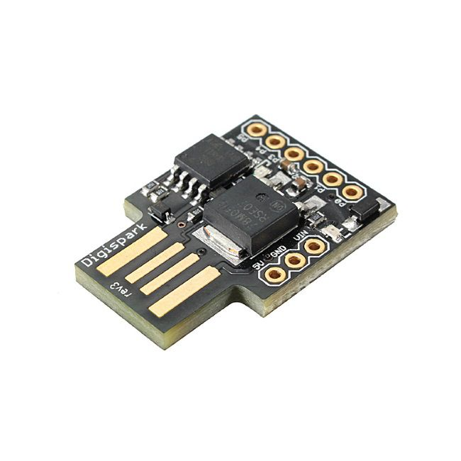

# attiny-pass-key

Type your password effortlessly.

## Context
Typing your password, sometimes, can be a pain.
For instance, when you don't have a keyboard connected directly to the device you want to access.
Or maybe you have a passphrase so large and complex that it is a hassle to type it every time.


**THIS PROJECT IS MADE FOR EDUCATIONAL PURPOSES ONLY. USE AT YOUR OWN RISK.**

## Purpose

This project is designed for the ATtiny microcontroller (specifically the Digispark/ATtiny85) to implement a passkey system. It acts as a USB keyboard device that automatically types a configured password when plugged in. This makes entering long passphrases effortless on machines where typing them is impractical — a convenience tool, not a security one.



## How It Works

Once plugged in, the device waits about a second, types the configured password followed by Enter into whatever window currently has focus, then blinks the on-board LED indefinitely.

## Features
- **Automated Password Entry**: Types a pre-configured password via USB HID.
- **Compact Codebase**: Optimized for ATtiny microcontrollers.
- **Configurable**: Password can be set via environment variables.

## Tools Used
- [Arduino CLI](https://arduino.github.io/arduino-cli/latest/): For building and uploading firmware.
- [mise](https://mise.jdx.dev/): For task management and tool versioning.
- **ATtiny85 / Digispark**: The target hardware platform.
- **Digistump's `DigiKeyboard` library**: USB HID functionality (vendored from the Digistump platform, referenced by path in `sketch.yaml`).

## Getting Started

### Prerequisites
- **mise**: This project uses `mise` to manage dependencies and tasks. Install it by following the [installation guide](https://mise.jdx.dev/getting-started.html).
- **Hardware**: A Digispark or ATtiny85 development board.

### Setup

1. **Clone the repository:**
   ```bash
   git clone https://github.com/lmarqs/attiny-pass-key.git
   cd attiny-pass-key
   ```

2. **Install Tools:**
   Run `mise install` to download the required version of `arduino-cli` and other tools defined in `mise.toml`.
   ```bash
   mise install
   ```

3. **Initialize Environment:**
   Run the setup task to configure the Arduino core and libraries.
   ```bash
   mise run setup
   ```
   This command will:
   - Create a `.env` file from `.env.example` if it doesn't exist.
   - Update the Arduino core and library indexes.

4. **Configure Password:**
   Open the `.env` file and set your desired password in the `ATTINY_PASS_KEY_PASSWORD` variable.
   ```bash
   ATTINY_PASS_KEY_PASSWORD="your_secure_password_here"
   ```

### Build and Upload

This project uses `mise` tasks to simplify the build process.

1. **Compile the Firmware:**
   ```bash
   mise run arduino:compile
   ```
   This compiles the sketch and injects the password from your `.env` file.

2. **Upload to Device:**
   ```bash
   mise run arduino:upload
   ```
   Connect your Digispark/ATtiny85 when prompted (or within the 60-second timeout window typical for Micronucleus bootloaders).

3. **All-in-one (Optional):**
   ```bash
   mise run arduino:run
   ```
   Runs compile + upload + monitor in sequence.

> **Note:** With `DigiKeyboard`, the Digispark enumerates as an HID-only device (V-USB provides no CDC serial), so `mise run arduino:monitor` will typically find no serial port — this sketch produces no serial output.

## Releases

Every push to `main` triggers a CI build that publishes a `build-<sha>` GitHub release with the build output. **Release artifacts are compiled without a `.env`, so the firmware contains the `default_password` fallback** — to embed your own password, build locally as described above.

## Project Structure

- `attiny-pass-key.ino`: The main Arduino sketch containing the logic.
- `mise.toml`: Configuration for `mise`, defining tools and tasks (compile, upload, setup).
- `arduino-cli.yaml`: Configuration file for `arduino-cli`.
- `sketch.yaml`: Defines the board profile (FQBN) and platform dependencies.
- `.env`: Stores sensitive configuration like the password (do not commit this file).
- `.arduino/`: Local sandboxed Arduino environment (platforms, tools, build output — gitignored), created by the setup and compile tasks.
